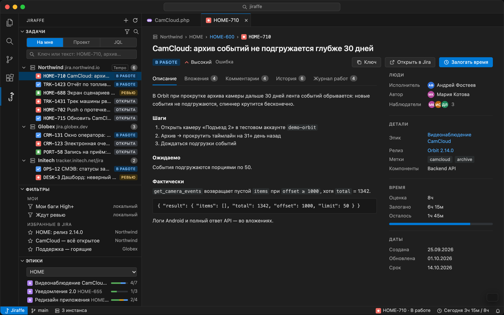
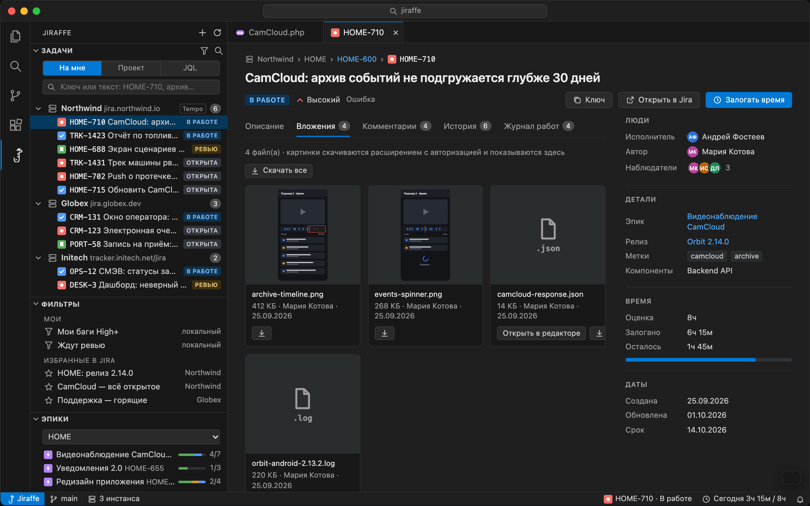
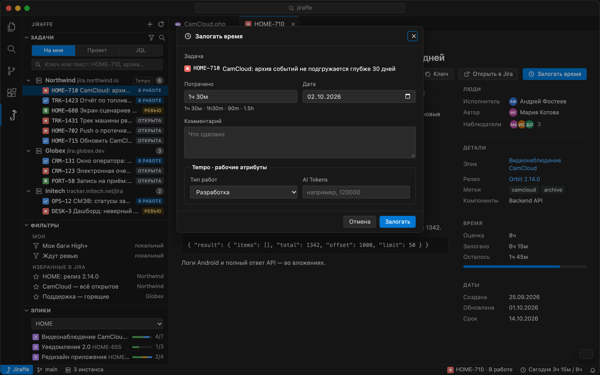
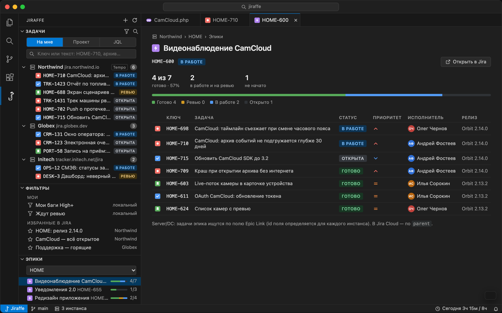
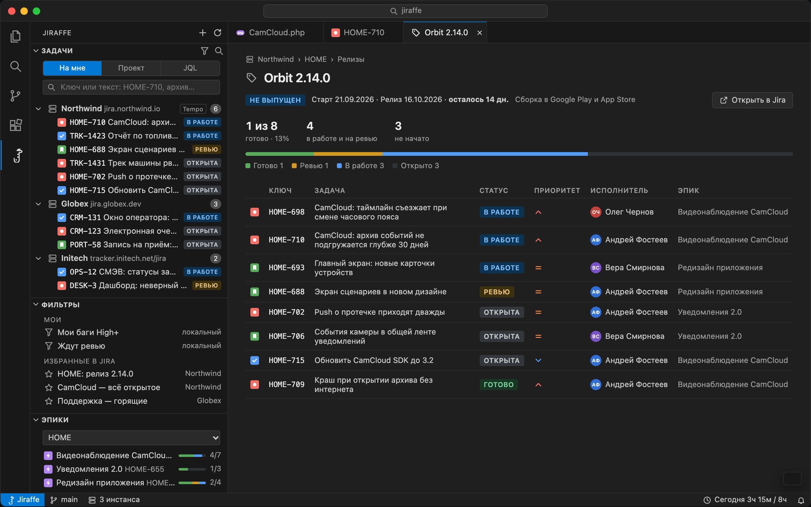

# Jiraffe 🦒

Jira inside VS Code: your issues, the full issue card, attachments, time logging (including Tempo), status changes, epics and releases. Works with several Jira instances at once — Server/Data Center and Cloud side by side.

It covers the daily routine, not all of Jira. Creating and editing issues is not there yet.

> The UI is in Russian for now. [Русская версия README](README.ru.md)



## Features

**Issues.** Assigned to me, by project, or any JQL. Quick filters by status category, type, priority and instance. Search by key (`ABC-123`) or text. Your saved filters and Jira favourite filters in a separate view.

**Issue card.** Description, comments, change history, work log, people, epic and fix versions. Clicking the status opens the transitions available to you; required fields with a list of values (resolution, etc.) are asked for in a picker.

**Attachments.** Image previews in the description, comments and attachments tab, with a lightbox. Download one or all, open text files in the editor. Files go to `.jiraffe/<KEY>/` in the workspace (git-ignored automatically).



**Time logging.** From the card or the tree. Uses Tempo where it is installed (including work attributes), the standard Jira worklog otherwise. The status bar shows how much you've logged today against your workday.



**Epics and releases.** Per-project lists with progress. An epic or release opens in a tab with a status breakdown and its issues.





## Supported Jira

| Type | Auth |
|---|---|
| Server / Data Center 8.22+ | Personal Access Token. A context path is fine: `https://host/jira` |
| Cloud | Account email + API token |

Tokens are stored in VS Code SecretStorage, never in `settings.json`. The extension talks only to the Jira instances you add, and runs only in trusted workspaces.

Tempo is supported on Server/DC. On Cloud, time goes to the standard worklog.

## Install

Requires VS Code 1.90+.

1. Download `jiraffe-<version>.vsix` from [Releases](https://github.com/fosteev/jiraffe/releases), or build it: `npm ci && npm run package`.
2. Command Palette → **Extensions: Install from VSIX…**, or `code --install-extension jiraffe-0.2.0.vsix`.
3. A giraffe icon appears in the Activity Bar.

## Adding an instance

Command Palette → **Jiraffe: Добавить инстанс** (Add instance), or the button in an empty view. Enter the URL, type and token. You can paste an issue link instead of the URL — the base address is taken from it. The connection is checked right away; a failing instance is not saved.

- **Server / Data Center:** Jira → avatar → Profile → Personal Access Tokens → Create token.
- **Cloud:** create a token at <https://id.atlassian.com/manage-profile/security/api-tokens>; use `https://your-domain.atlassian.net` and your Atlassian account email.

### Instances per workspace

Connections are shared across windows, but each workspace can show only some of them: the server icon in the Issues or Filters view title, or in `.vscode/settings.json`:

```json
{ "jiraffe.instances": ["https://jira.example.com"] }
```

Mode, project, quick filters and the Epics/Releases project are remembered per workspace too.

## Settings

| Setting | Default | |
|---|---|---|
| `jiraffe.instances` | all | Instances shown in this workspace (URLs or ids) |
| `jiraffe.maxResults` | 50 | Page size for issue and epic lists |
| `jiraffe.attachmentsDir` | `.jiraffe` | Where attachments are saved, relative to the first workspace folder |
| `jiraffe.maxImageMb` | 5 | Max image size for previews |
| `jiraffe.workdayHours` | 8 | Workday length for the "today" summary |

## Not yet

Subtasks and linked issues, assigning, creating and editing issues, comments, weekly time summary, Tempo Cloud.

## Development

```sh
npm ci
npm run watch   # then F5 in VS Code
npm test
npm run lint
```
